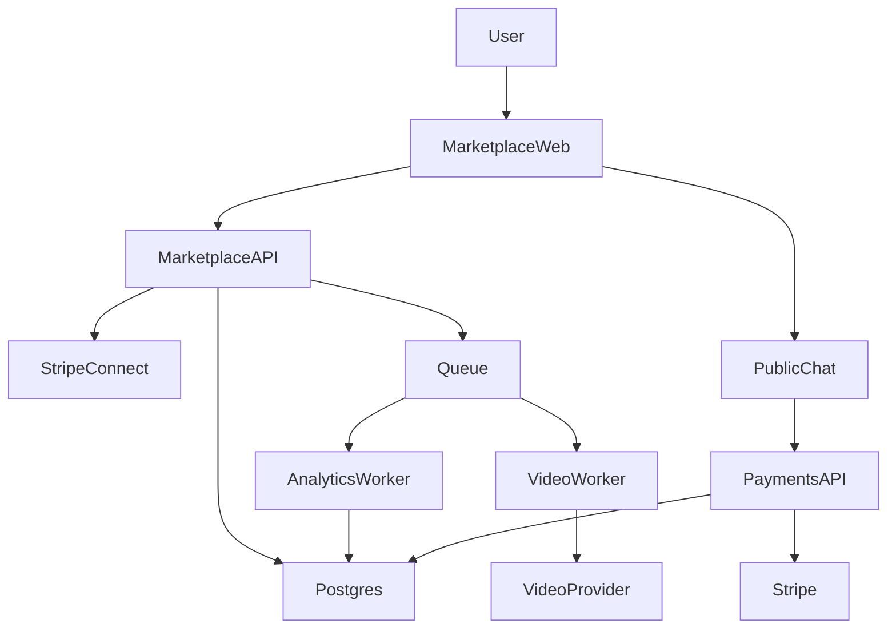

# Phase 2+3 Implementation Plan

## Current State and Gaps

- **Already implemented**: WhatsApp + Instagram integrations, voice cloning, pay‑per‑chat (Stripe PaymentIntent), public profile + public chat, widget + analytics, creator dashboard analytics, Stripe subscriptions (billing module). Core files: `backend/src/modules/whatsapp/*`, `backend/src/modules/instagram/*`, `backend/src/modules/voice/*`, `backend/src/modules/payments/*`, `backend/src/modules/billing/*`, `backend/src/modules/public/*`, `backend/src/modules/creator/*`, `frontend/react-app/src/pages/Integrations.tsx`, `frontend/react-app/src/pages/PublicChatPage.tsx`, `frontend/react-app/src/pages/CreatorDashboardPage.tsx`, `frontend/react-app/src/pages/CreatorPublicProfile.tsx`.
- **Missing or partial**: Marketplace discovery/listings + reviews, paid subscriptions for marketplace items, video avatars, phone integration, advanced analytics pipeline, mobile apps. Some schema elements exist (`stripe_payments`, `stripe_payouts`, `chat_sessions`, `chat_messages`) but need marketplace‑specific tables and flows.

## Target Architecture (Additive)

- **New backend modules**: `backend/src/modules/marketplace/`, `backend/src/modules/video/`, `backend/src/modules/phone/` plus queue workers in `backend/src/workers/` (separate process) for long‑running jobs (video generation, voice generation for phone, analytics aggregation).
- **New services**: `backend/src/services/stripeConnectService.ts`, `backend/src/services/twilioVoiceService.ts`, `backend/src/services/videoAvatarService.ts`, `backend/src/services/analyticsAggregationService.ts`.
- **Frontend routes/pages**: `/marketplace`, `/marketplace/:slug`, `/marketplace/manage`, `/video/setup`, `/video/manage`, `/phone/setup`, plus mobile app in a new `mobile/` directory (Expo).

## Workstream A: Marketplace (Discovery + Listings + Reviews)

1. **Schema additions** (extend `backend/src/config/database.ts`):

   - `marketplace_listings` (creatorId, isPublic, category, subscriptionPriceCents, freeTrialQuestions, description, tags, totals, rating).
   - `marketplace_reviews` (listingId, userId, rating, comment, createdAt).
   - `marketplace_subscriptions` (listingId, userId, stripeSubscriptionId, status, periodStart/End).

2. **Backend module** `backend/src/modules/marketplace/`:

   - `listingRoutes.ts` + `listingController.ts` for CRUD and public query endpoints.
   - `reviewRoutes.ts` + `reviewController.ts` for create/list reviews and rating aggregation.
   - `subscriptionRoutes.ts` + `subscriptionController.ts` for subscribe/cancel/status.

3. **Public discovery endpoints** (pagination + filter):

   - `GET /api/marketplace/listings` with `category`, `minPrice`, `maxPrice`, `tags`, `rating`, `sort`, `page`.
   - `GET /api/marketplace/listings/:slug` with listing + creator profile + stats.

4. **Frontend pages**:

   - `frontend/react-app/src/pages/MarketplacePage.tsx` (search, filters, grid).
   - `frontend/react-app/src/pages/MarketplaceListingPage.tsx` (detail, subscribe, reviews).
   - `frontend/react-app/src/pages/MarketplaceManagePage.tsx` (creator controls, visibility, pricing, tags).

5. **Search strategy**: start with Postgres `ILIKE` + tag array; optionally add Algolia later.
6. **Review flow**: collect reviews after paid session ends; enforce one review per user+session.

## Workstream B: Subscriptions + Stripe Connect (Marketplace payouts)

1. **Stripe Connect onboarding**:

   - Add `stripeConnectId` + `payoutEnabled` (already in `User` table) and wiring endpoints in `creator` module.
   - Implement onboarding link endpoints: `POST /api/creator/stripe/connect` and `GET /api/creator/stripe/status`.

2. **Revenue split**:

   - Use Stripe Connect destination charges for marketplace subscriptions; store transfer ids in `stripe_payments`.
   - Extend webhook handling in `backend/src/modules/billing/stripeController.ts` to map marketplace subscriptions and update `marketplace_subscriptions`.

3. **Payouts**:

   - Use existing `stripe_payouts`/`payout_requests` tables for creator payout tracking.
   - Implement scheduled payouts (weekly/monthly) in worker; ensure idempotency on Stripe webhook events.

4. **Currency + taxes**:

   - Keep currency USD baseline; add configurable currency per listing if needed.
   - Ensure India export rules already handled for subscription checkout (keep billing address collection).

## Workstream C: Pay‑Per‑Chat Enhancements

1. **Align tiers to Phase 2**:

   - Expand `priceConfig` to allow creator‑defined tiers and rules (already in `User.priceConfig`).
   - Update `frontend/react-app/src/pages/Integrations.tsx` to expose tier customization (premium/vip labels, triggers).

2. **Payment links in IG/WA**:

   - Add optional pay‑per‑chat flow for WhatsApp/Instagram to send Stripe Checkout URLs when payment required.
   - Store payment context in `chat_sessions` and verify on webhook before unlocking reply.

3. **Abuse controls**:

   - Rate limit paywall creation and payment intent endpoints (`backend/src/middleware/rateLimit.ts`).
   - Log `PAYMENT_REQUIRED`/`PAYMENT_COMPLETED` events (already partially in `publicController.ts`).

## Workstream D: Video Avatars

1. **Schema**: add `video_avatars` table (id, userId, provider, avatarId, sampleVideoUrl, status, settings).
2. **Backend module** `backend/src/modules/video/`:

   - `videoController.ts` for upload/train/generate.
   - `videoService.ts` for provider calls + S3/R2 storage.

3. **Worker**:

   - Use a queue (BullMQ/Redis) for long video generation; store job status in DB.

4. **Frontend**:

   - `VideoSetupPage.tsx`, `VideoManagePage.tsx`, and integrate a video reply toggle in `MirrorPage.tsx`.

## Workstream E: Phone Integration (Twilio Voice)

1. **Schema**: `phone_calls` table with caller, duration, transcript, recordingUrl, amountCharged, createdAt.
2. **Backend module** `backend/src/modules/phone/`:

   - Webhook endpoint to handle Twilio Voice calls, stream prompts, and manage call state.
   - Integrate STT (Whisper) + TTS (ElevenLabs) using async worker for response generation.

3. **Billing**:

   - Per‑minute charge; store payments in `stripe_payments` with type `phone_call`.

4. **Frontend**:

   - Add `/phone/setup` page and embed in Integrations UI.

## Workstream F: Advanced Analytics

1. **Aggregation strategy**:

   - Create `analytics_daily` table and hourly/weekly aggregation jobs.
   - Extend `creator` controller to query aggregated stats instead of raw logs.

2. **Dashboard expansion**:

   - Add geo breakdown, conversion funnel, platform mix, peak hours, sentiment trend.
   - Provide CSV export already exists; extend to PDF export if needed.

3. **Observability**:

   - Ensure errors logged to `error_logs` table and optionally Sentry.

## Workstream G: Mobile Apps (iOS/Android)

1. **New `mobile/` workspace (Expo)**:

   - Auth, marketplace browse, chat (public + paid), voice playback, profile.

2. **API reuse**:

   - Use existing `/api/public/chat`, `/api/payments/pay-per-chat`, `/api/marketplace/*`.

3. **Push notifications**:

   - Firebase Cloud Messaging integration for creators.

## Cross‑Cutting Concerns

- **Security**: webhook signature validation, replay protection (timestamp + signature), idempotency keys for Stripe webhooks.
- **Queue separation**: keep async consumers separate from HTTP servers as per platform guideline.
- **Localization**: add language fallback (default to English) for user‑facing copy in new features.
- **Validation**: strict Zod schemas for all public endpoints; sanitize user‑generated content.
- **Rate limits**: add per‑creator limits for IG/WA/phone to avoid provider bans.

## Tests and Rollout

- Unit tests for controllers/services; integration tests for webhooks and payment flows.
- Staged rollout: enable new features behind feature flags in `backend/src/config/featureFlags.ts`.
- Backfill data migration scripts for listings and existing creators.

## External References

- Stripe Connect: https://stripe.com/docs/connect
- Stripe Webhooks/PaymentIntents: https://stripe.com/docs/webhooks and https://stripe.com/docs/payments/payment-intents
- Stripe India exports: https://stripe.com/docs/india-exports
- Meta Instagram Messaging: https://developers.facebook.com/docs/messenger-platform/instagram
- Twilio WhatsApp: https://www.twilio.com/docs/whatsapp
- Twilio Voice: https://www.twilio.com/docs/voice
- ElevenLabs API: https://docs.elevenlabs.io
- D-ID API: https://docs.d-id.com
- Expo/React Native: https://docs.expo.dev and https://reactnative.dev
- TimescaleDB: https://docs.timescale.com

## Implementation Todos

- `marketplace-core`: build marketplace schema + backend module + discovery UI
- `stripe-connect`: integrate Connect onboarding + payouts + webhook mapping
- `video-avatars`: add video module + worker + UI
- `phone-integration`: implement Twilio Voice flow + billing + UI
- `analytics-v2`: add aggregation jobs + dashboard upgrades
- `mobile-app`: scaffold Expo app and core screens