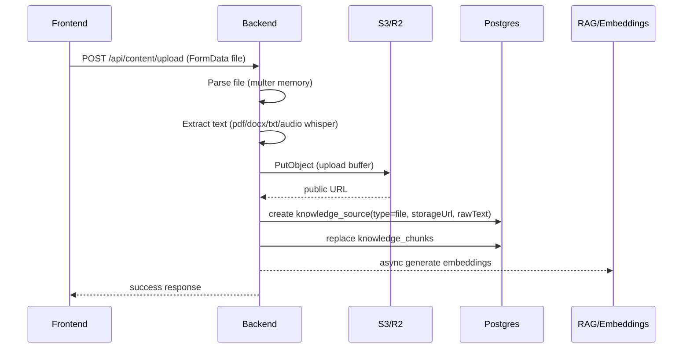
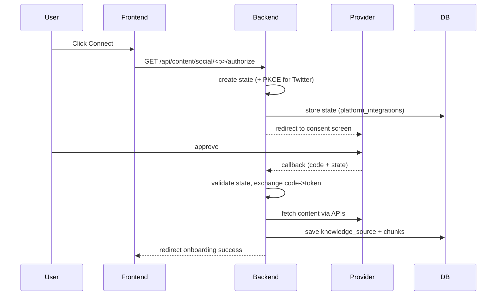

### A‑Z Setup Guide (Local → Prod → Live) for your Phase 1/2/3 build

You said: **DB_URL + OpenAI keys + Stripe keys set**, बाकी कुछ नहीं. Goal: **local test → prod deploy → go live**.  
Below is a **copy‑paste friendly MD** style guide with **diagrams + exact env checklist + where to create accounts + what happens in flow**.

---

## 0) Mental model: your app’s “big pipes”

### 0.1 What features depend on what
- **Auth / Core UI** → DB required
- **Knowledge sources**
  - **Paste / URL** → DB (and outbound internet fetch)
  - **File upload** → **S3/R2 is REQUIRED** (otherwise upload 500)
  - **YouTube video URL transcript** → no OAuth, transcript availability matters
  - **YouTube/Twitter/Instagram OAuth import** → respective platform apps + env keys
- **Training (embeddings/RAG)** → OpenAI/Groq keys (depending what you use) + DB
- **Email “training ready” + OTP emails (prod)** → Resend key (in your code it’s `SMTP_PASS`)
- **Payments** → Stripe keys + webhook setup (prod)

### 0.2 End‑to‑end flow diagram (high level)
```mermaid
flowchart TD
  FE[Frontend (Vite)] -->|/api via proxy| BE[Backend API (Express)]
  BE --> DB[(Postgres)]
  BE --> S3[(S3/R2 Storage)]
  BE --> LLM[Groq/OpenAI APIs]
  BE --> EMB[Embeddings + RAG]
  BE --> EMAIL[Resend Email API]
  BE --> OAUTH[Google/Twitter/Meta OAuth]
  OAUTH --> BE
```

---

## 1) Local dev: run everything reliably

### 1.1 Node version (important for Vite)
- Vite wants **Node 20.19+** or **22.12+**
- Install Node 20.19.x LTS, then verify:
```powershell
node -v
```

### 1.2 Backend `.env` location (very important)
Your backend loader currently points to:
- `path.resolve(__dirname, '../../.env')` where `__dirname = backend/src/config`
- so it expects **`.env` at `backend/src/.env`**

So for local dev either:
- Put env file at **`backend/src/.env`**, OR
- set env vars in your shell, OR
- later change code to load `backend/.env` (optional improvement)

### 1.3 Frontend env (proxy target)
Your Vite proxy uses `VITE_DEV_API_PROXY_TARGET` (defaults to `http://localhost:3000`).

If backend runs on `3000`, set nothing. If backend runs on `5000`, set:
```env
VITE_DEV_API_PROXY_TARGET=http://localhost:5000
```

---

## 2) The missing piece causing your current 500: Storage (S3/R2)

### 2.1 Why upload fails
Your file upload uses `uploadPublicBuffer()` which hard-requires `S3_BUCKET`.  
No storage env ⇒ **upload 500**.

### 2.2 Recommended for local + prod: Cloudflare R2 (S3-compatible)
You need **an S3-compatible bucket**. For local testing, R2 is easiest.

#### Step-by-step (R2)
1. Go to **Cloudflare Dashboard** → **R2**
2. Create a **Bucket** (example: `ai-identity-dev`)
3. Create **R2 API Tokens / Access Keys** (S3-compatible credentials)
4. Note your:
   - **Account ID**
   - **Access Key ID**
   - **Secret Access Key**
5. Public access:
   - Either configure a **public bucket/domain** (recommended), or use an allowed public base URL. Your code does **not** set ACL; it expects bucket/public domain to serve files.

#### Env to add (local)
```env
S3_BUCKET=ai-identity-dev
S3_REGION=ap-south-1

AWS_ACCESS_KEY_ID=xxxxx
AWS_SECRET_ACCESS_KEY=xxxxx

S3_ENDPOINT=https://<accountid>.r2.cloudflarestorage.com
S3_FORCE_PATH_STYLE=true

# Recommended so generated URLs are correct:
S3_PUBLIC_BASE_URL=https://<your-public-domain-or-r2dev>
```

### 2.3 Upload flow (what happens when user uploads a file)


---

## 3) URL import setup (no extra accounts, but know limitations)

### 3.1 What it does
- Backend fetches the URL HTML and strips to text.
- Stores into DB and chunks.
- Embeddings async.

### 3.2 What to expect in real world
- Works best on simple HTML pages.
- Fails/empty for:
  - Cloudflare bot-protected pages
  - JS-rendered pages (content not in HTML)
  - PDFs via URL (your URL importer doesn’t parse PDFs; file uploader does)

No special env is required here.

---

## 4) Email setup (dev vs prod)

### 4.1 Why you saw “Training ready email failed”
Your training job processor tries:
- `EmailService.sendTrainingReady(user.email)`

Your EmailService uses **Resend**, and reads the Resend API key from:
- `SMTP_PASS` (yes, confusing name, but that’s what the code does)

### 4.2 Local dev
- You can ignore emails if you want (training can still run)
- But if you want them working, set Resend.

### 4.3 Prod/live (recommended)
#### Resend setup (step-by-step)
1. Go to [Resend](https://resend.com/)
2. Create an API key (`re_...`)
3. Add a verified sender domain/email (recommended)

Env:
```env
SMTP_PASS=re_xxxxxxxxxxxxxxxxx
MAIL_FROM=you@yourdomain.com
SUPPORT_EMAIL=you@yourdomain.com
```

---

## 5) Social imports (OAuth) — full A→Z setup + how it reads data

You already understood the core idea correctly:
**user clicks connect → provider consent → callback code → exchange token → call APIs → store text.**  
Below is the “exact setup needed” for each.

---

### 5.1 Generic OAuth flow (applies to all)


---

### 5.2 YouTube (Google OAuth) — setup
#### What you need (Google Cloud Console)
1. Go to [Google Cloud Console](https://console.cloud.google.com/)
2. Create/select Project
3. Enable **YouTube Data API v3**
4. Configure **OAuth consent screen**
5. Create **OAuth client ID (Web application)**
6. Add redirect URI (local):
   - `http://localhost:3000/api/content/social/youtube/callback`

Env:
```env
GOOGLE_CLIENT_ID=...
GOOGLE_CLIENT_SECRET=...
YOUTUBE_OAUTH_CALLBACK_URL=http://localhost:3000/api/content/social/youtube/callback
```

#### How it reads data
- Token gives access to the user’s YouTube account
- Backend calls:
  - `channels?mine=true` → channel + uploads playlist
  - `playlistItems` → last 50 videos (title/description/url)
- Converts to text → stores as knowledge source

---

### 5.3 Twitter/X (OAuth 2.0 + PKCE) — setup
#### What you need (X Developer Portal)
1. Go to [X Developer Portal](https://developer.x.com/)
2. Create Project/App
3. Enable OAuth 2.0
4. Add callback URL:
   - `http://localhost:3000/api/content/social/twitter/callback`

Env:
```env
TWITTER_CLIENT_ID=...
TWITTER_CLIENT_SECRET=...
TWITTER_CALLBACK_URL=http://localhost:3000/api/content/social/twitter/callback
```

#### How it reads data
- Token → `GET /2/users/me` to get user id
- Then `GET /2/users/:id/tweets?...`
- Builds text dump → stores as knowledge source

---

### 5.4 Instagram (Meta Graph API) — setup (most strict)
This is not “basic Instagram login”; it’s the **Meta Graph** approach for **Professional accounts**.

#### Requirements
- Instagram account must be **Professional** (Business/Creator)
- It must be connected to a **Facebook Page**

#### What you need (Meta Developers)
1. Go to [Meta for Developers](https://developers.facebook.com/)
2. Create an App
3. Add product: **Facebook Login**
4. Set redirect URI:
   - `http://localhost:3000/api/content/social/instagram/callback`
5. Ensure permissions your code requests are allowed:
   - `pages_show_list`
   - `instagram_basic`
   - `instagram_manage_comments`

Env:
```env
META_APP_ID=...
META_APP_SECRET=...
INSTAGRAM_CALLBACK_URL=http://localhost:3000/api/content/social/instagram/callback
```

#### How it reads data
- Exchange code → token
- Fetch pages: `/me/accounts`
- Fetch IG business account linked to page:
  - `/{pageId}?fields=instagram_business_account{id,username}`
- Fetch media:
  - `/{igUserId}/media?...`
- Build text → store chunks

---

## 6) Prod deployment plan (clean + safe)

### 6.1 “Prod” env strategy
You should prepare **two env sets**:
- **Local**: minimal, can skip email + social
- **Prod**: strict, includes email + storage + OAuth + Stripe webhooks

### 6.2 Prod checklist (must-have)
- **DATABASE_URL** (prod Postgres)
- **S3/R2** working (uploads)
- **JWT/SESSION secrets**
- **FRONTEND_URL** (used for email links, redirects)
- **SMTP_PASS (Resend)** (if you want emails)
- **Stripe** (secret + webhook secret)
- Optional but recommended:
  - PostHog key
  - Sentry DSN

---

## 7) Immediate fixes you should do now (so local testing becomes smooth)

### 7.1 Fix upload crash logging (so errors print properly)
Update upload catch to:
```ts
logger.error({ err: error }, 'Upload error');
```

### 7.2 Add S3/R2 envs (required)
Set R2/S3 env exactly (section 2.2) and restart backend.

### 7.3 Social connect will 500 until you add OAuth envs
If you click Twitter/IG/YouTube connect without env keys, `/authorize` will 500 (expected). Set envs first.

---

## 8) One consolidated “starter env” (copy/paste template)

### 8.1 Local (minimum to test knowledge features)
```env
# Core
APP_ENV=local
NODE_ENV=development
PORT=3000
DATABASE_URL=...

# LLM / embeddings
OPENAI_API_KEY=...
GROQ_API_KEY=...

# Storage (REQUIRED for file upload)
S3_BUCKET=...
S3_REGION=ap-south-1
AWS_ACCESS_KEY_ID=...
AWS_SECRET_ACCESS_KEY=...
S3_ENDPOINT=https://<accountid>.r2.cloudflarestorage.com
S3_FORCE_PATH_STYLE=true
S3_PUBLIC_BASE_URL=https://...

# Email (optional local)
SMTP_PASS=re_...
MAIL_FROM=...
SUPPORT_EMAIL=...

# Social OAuth (optional local)
GOOGLE_CLIENT_ID=...
GOOGLE_CLIENT_SECRET=...
YOUTUBE_OAUTH_CALLBACK_URL=http://localhost:3000/api/content/social/youtube/callback

TWITTER_CLIENT_ID=...
TWITTER_CLIENT_SECRET=...
TWITTER_CALLBACK_URL=http://localhost:3000/api/content/social/twitter/callback

META_APP_ID=...
META_APP_SECRET=...
INSTAGRAM_CALLBACK_URL=http://localhost:3000/api/content/social/instagram/callback

# Stripe (you already did)
STRIPE_SECRET_KEY=...
STRIPE_WEBHOOK_SECRET=...
```

---

If you switch to **Agent mode**, I can do the “hands-on” part: add the `logger.error({ err })` improvement, confirm your backend env path, and help you choose the fastest storage option (R2 vs AWS S3) based on what accounts you already have.


#S3
Token value: 
vZgFy-AFuhFddztmDy47xFFljTcnfAImIaoGMKSP

Use jurisdiction-specific endpoints for S3 clients:
DefaultEuropean Union (EU)
https://0ee444084e868589c5da757a15530822.r2.cloudflarestorage.com